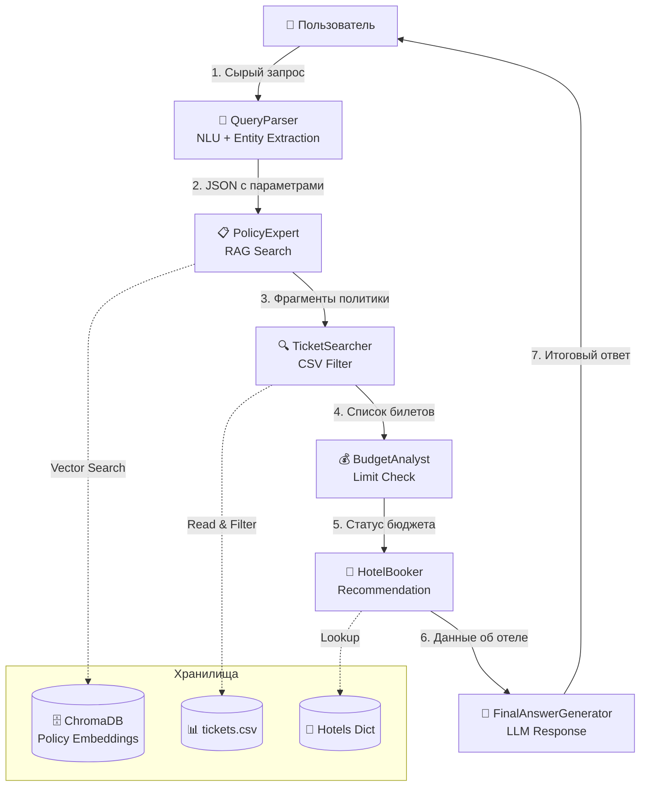
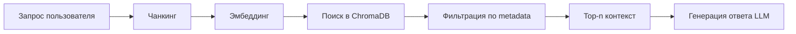

# Travel Assistant — Архитектура системы

## Обзор проекта
**Travel Assistant** — это мультиагентная система (MaaS), спроектированная для автоматизации бизнес-процесса оформления командировок. Система реализует паттерн «Умный помощник» (Smart Assistant), используя RAG-пайплайн для работы с корпоративными знаниями и оркестрацию на базе `LangGraph`.

**Ключевые компоненты:**
- **RAG (Retrieval-Augmented Generation):** Извлечение релевантных правил из корпоративной политики.
- **Мультиагентная оркестрация:** Последовательный пайплайн специализированных агентов под управлением `StateGraph`.
- **LLM-провайдеры:** Поддержка облачных (OpenRouter) и локальных (Ollama/LM Studio) моделей с fallback-механизмом.
- **Векторное хранилище:** ChromaDB (in-memory/persistent) для хранения эмбеддингов политик.

## Архитектура системы и паттерны агентов

Система построена на основе паттерна **Sequential Agent Pipeline** внутри LangGraph. Оркестрация осуществляется через явно объявленные переходы графа, что гарантирует детерминированное выполнение и простоту отладки.

### 1. Выбор паттернов агентов

| Агент | Паттерн | Функция | Инструменты/Данные |
| :--- | :--- | :--- | :--- |
| `QueryParser` | NLU / Pre-processor | Извлекает сущности (город, дата, предпочтения), нормализует данные. | LLM + PydanticParser |
| `PolicyExpert` | RAG Agent | Проверяет соответствие запроса корпоративной политике, возвращает контекст. | ChromaDB, `policies.txt` |
| `TicketSearcher` | Tool Use / Worker | Фильтрует и сортирует билеты по параметрам запроса. | Pandas, `tickets.csv` |
| `BudgetAnalyst` | Validator | Сравнивает стоимость найденных билетов с лимитами из политики. | Логика проверки лимитов |
| `HotelBooker` | Recommender | Подбирает отель в городе назначения по внутренней базе. | In-memory Dict |
| `FinalAnswerGenerator` | LLM Synthesizer | Агрегирует все контексты и генерирует финальный ответ пользователю. | LLM Prompt Engineering |

### 2. Схема взаимодействия агентов

**Поток данных:**
1. Пользователь вводит запрос на естественном языке.
2. `QueryParser` через LLM извлекает сущности, приводит города к именительному падежу и даты к `YYYY-MM-DD`.
3. `PolicyExpert` делает векторный поиск по `ChromaDB` с фильтром `source="policy"`, возвращая релевантные правила.
4. `TicketSearcher` фильтрует DataFrame по городам и дате, сортирует по цене/прямоте рейса.
5. `BudgetAnalyst` проверяет, укладываются ли найденные билеты в лимит `50 000 ₽`.
6. `HotelBooker` подбирает отель в городе прибытия из локальной базы.
7. `FinalAnswerGenerator` собирает все контексты в промпт и генерирует дружелюбный ответ через LLM.

---

## RAG Flow (Retrieval-Augmented Generation)

Детальный пайплайн работы с базой знаний:

### 1. Чанкинг (Chunking)
Текст политики разбивается на перекрывающиеся фрагменты с помощью `RecursiveCharacterTextSplitter`:
- `chunk_size = 500` символов
- `chunk_overlap = 50` символов
*Обоснование:* Сохраняет логическую целостность правил (например, связь «класс билета ↔ длительность перелёта»).

### 2. Эмбеддинг (Embedding)
Используется модель `sentence-transformers/all-MiniLM-L6-v2` (размерность 384). Векторы нормализуются (`normalize_embeddings=True`), что повышает точность косинусного сходства.

### 3. Векторное хранилище
Эмбеддинги сохраняются в `ChromaDB`. Каждому документу добавляется метаданные: `{"source": "policy"}` или `{"source": "ticket", ...}` для возможности точечной фильтрации при поиске.

### 4. Поиск и фильтрация
- Выполняется семантический поиск топ-кандидатов (`k=3`).
- **Мета-фильтрация:** В коде явно применяется фильтр `filter={"source": "policy"}`, чтобы исключить попадание билетов в контекст политики.
- **Реранкинг (v2.0):** В рамках лабораторного прототипа реранкинг через Cross-Encoder (`ms-marco-MiniLM`) не реализован для снижения требований к памяти в Colab. Архитектура предусматривает его подключение через `ContextualCompressionRetriever` в следующих итерациях.

---

## Прототипирование (LangGraph)

В `travel_assistant.ipynb` реализована рабочая логика мультиагентной системы:

- **Оркестрация:** Построен граф состояний (`StateGraph`), где каждый узел — отдельный агент-класс.
- **Управление потоком:** Использована последовательная цепочка `add_edge`. Это реализует паттерн делегирования «Менеджер → Рабочие», где `StateGraph` выступает в роли диспетчера, автоматически передающего обновлённый `AgentState` между узлами.
- **Состояние:** Типизированный словарь (`TypedDict`) гарантирует передачу строго определённых ключей (`user_query`, `parsed_query`, `policy_context`, `tickets`, `budget_ok`, `recommended_hotel`, `final_answer`).