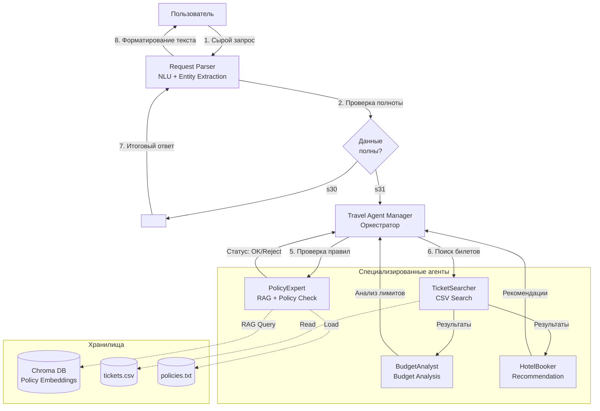
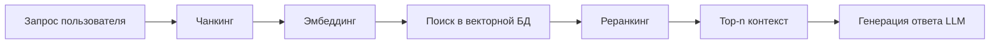

# 🛫 Travel Assistant — Архитектура системы

## 📋 Обзор проекта

**Travel Assistant** — это мультиагентная система, спроектированная для автоматизации бизнес-процесса оформления командировок. Система реализует паттерн «Умный помощник», используя RAG-пайплайн для работы с корпоративными знаниями и оркестрацию на базе LangGraph.

**Ключевые компоненты:**
- **RAG (Retrieval Augmented Generation):** Поиск релевантных правил политики компании.
- **Мультиагентная архитектура:** Специализированные агенты (Поисковик, Аналитик, Бронировщик) под управлением оркестратора.
- **LLM-провайдеры:** Поддержка локальных моделей (Ollama/LM Studio) и облачных (OpenRouter).
- **Векторное хранилище:** Chroma (InMemory) для хранения эмбеддингов политик.

---

## 🏗️ Архитектура системы и паттерны агентов

Система построена на основе паттерна **Hierarchical Multi-Agent** с обязательным этапом предварительной обработки запроса (NLU). Центральный оркестратор координирует работу специализированных агентов.

### 1. Выбор паттернов агентов

| Агент | Паттерн | Функция | Инструменты/Данные |
| :--- | :--- | :--- | :--- |
| **Request Parser** | *NLU / Pre-processor* | Извлекает сущности (город, даты, бюджет), нормализует данные, валидирует полноту запроса. | LLM (Entity Extraction), Regex, Валидаторы. |
| **Travel Manager** | *Orchestrator* | Принимает структурированный запрос, декомпозирует задачу, управляет потоком, агрегирует ответы. | LangGraph `StateGraph`, условные переходы. |
| **PolicyExpert** | *RAG Agent* | Проверяет соответствие запроса корпоративной политике. | RAG пайплайн, `policies.txt`, Chroma DB. |
| **TicketSearcher** | *Tool Use / Worker* | Ищет доступные билеты по параметрам. | Парсинг `tickets.csv`, фильтрация данных. |
| **BudgetAnalyst** | *Analyzer* | Анализирует стоимость и лимиты бюджета. | Логика проверки лимитов, данные из RAG. |
| **HotelBooker** | *Recommender* | Предлагает варианты отелей на основе найденных билетов. | Логика подбора, интеграция с внешними API (опционально). |

### 2. Схема взаимодействия агентов

**Поток данных:**
1. **Пользователь** вводит запрос.
2. **Request Parser** извлекает сущности, нормализует данные и проверяет полноту. При отсутствии данных запрашивает уточнение.
3. **Travel Manager** получает валидный JSON и инициирует параллельную работу агентов.
4. **PolicyExpert** использует RAG для извлечения правил.
5. **TicketSearcher** парсит CSV и возвращает варианты.
6. **BudgetAnalyst** и **HotelBooker** выполняют свои задачи.
7. **Manager** агрегирует результаты и передает их обратно в **Parser**.
8. **Request Parser** формирует финальный ответ в естественном языке для пользователя.

---

## 🔄 RAG Flow (Retrieval Augmented Generation)

### Детальный пайплайн

### 1. Чанкинг (Chunking)
Текст политики разбивается на перекрывающиеся фрагменты (chunk size ~500 символов, overlap ~50 символов) для сохранения контекста и повышения точности поиска.

### 2. Эмбеддинг (Embedding)
Текстовые чанки преобразуются в векторные представления (размерность 384) с использованием модели `sentence-transformers/all-MiniLM-L6-v2`. Нормализация векторов улучшает качество косинусного сходства.

### 3. Векторное хранилище
Эмбеддинги сохраняются в векторную базу данных ChromaDB с метаданными (`source`, `page`) для быстрого поиска и фильтрации.

### 4. Поиск и Реранкинг
Производится поиск топ-k кандидатов (k=5) через векторный индекс. Опционально применяется реранкинг с использованием Cross-Encoder для уточнения релевантности и отбора лучших фрагментов.

**Результат:** Top-3 наиболее релевантных фрагмента текста передаются в LLM для генерации ответа.

---

## 💻 Прототипирование (LangChain + LangGraph)

В рамках прототипа реализована базовая логика мультиагентной системы на базе **LangGraph**:

- **Оркестрация:** Построен граф состояний (`StateGraph`), где узлы представляют агентов (Менеджер, Поисковик).
- **Управление потоком:** Реализован условный переход: если результат поиска отсутствует, управление передается агенту-поисковику; при наличии результата — формируется финальный ответ.
- **Состояние:** Используется типизированный словарь (`TypedDict`) для передачи данных между агентами (сообщения, результаты поиска, финальный ответ).
- **Имитация работы:** Агенты демонстрируют логику делегирования задач и агрегации результатов без внешних зависимостей (используется мок-данные).

Прототип подтверждает работоспособность паттерна «Менеджер-Рабочий» и готов к расширению реальными интеграциями (RAG, API).

---

## 🚀 Заключение

Прототип мультиагентной travel-ассистент создан. Система:
- Использует RAG с чанкингом, эмбеддингом и векторным хранилищем.
- Управляется через LangGraph StateGraph.
- Поддерживает переключение между локальной LLM и OpenRouter.
- Работает с Chroma (с возможностью сохранения на диск).

*Документ обновлен в соответствии с требованиями домашнего задания.*